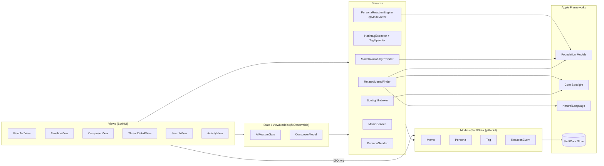
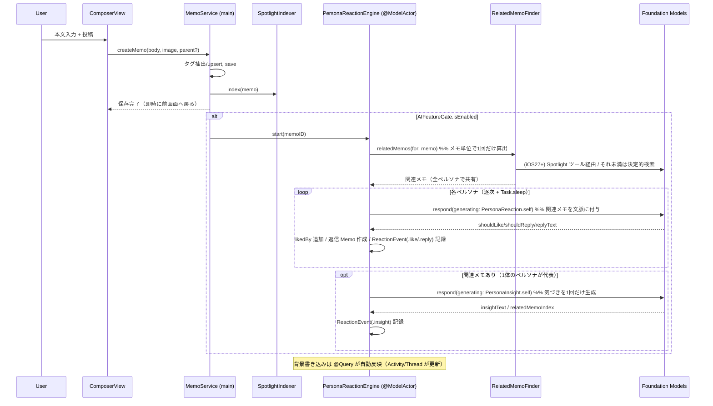
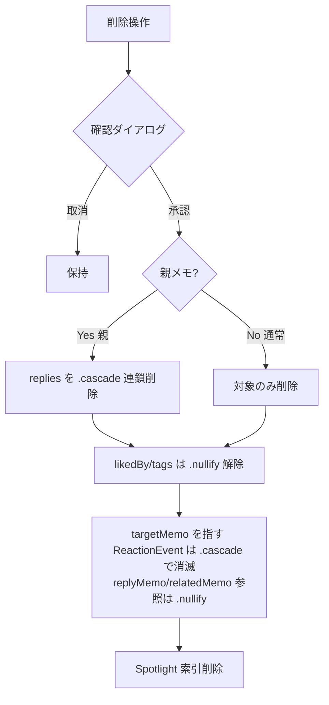
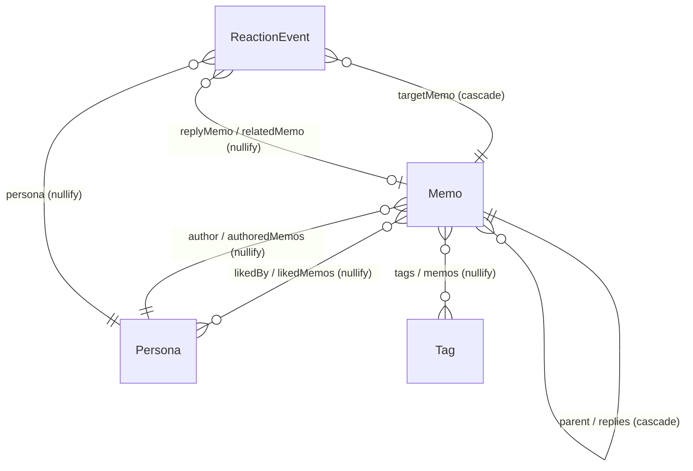

# 技術設計書: Tegaru（x-style-memo-app）

## Overview

**Purpose**: Tegaru は、X(Twitter) の「短文を放り込み、時系列で振り返り、反応が返る」流儀だけを借りた個人用・ローカル完結のメモアプリである。本設計は要件（WHAT）を SwiftUI + SwiftData + Foundation Models によるオンデバイス実装（HOW）へ落とし込む。

**Users**: 単一ユーザー（端末の所有者）。メモの投稿・編集・閲覧・検索を日常的に行い、対応端末では AI ペルソナからのいいね・リプライ・関連メモの気づきを受け取る。

**Impact**: 新規グリーンフィールド。サーバー・認証・ネットワークを一切持たず、すべての状態を端末サンドボックス内の SwiftData ストアに保持する。AI は端末内推論のみで、データは端末外へ出ない。

### Goals
- コア機能（投稿・編集・削除・タグ・検索・スレッド・画像）を SwiftData `@Query` 直結で滑らかに提供（Req 1–7, 16, 14）。
- AI 機能（ペルソナのいいね・リプライ・RAG・アクティビティ）をバックグラウンドで非ブロックに上乗せ（Req 8–11）。
- 端末の AI 可用性に応じた縮退で、非対応端末でも純粋なメモアプリとして成立（Req 12）。
- ローカル完結・端末外送信なしのプライバシー保証（Req 13）。

### Non-Goals
- メモ以外の SNS 機能（フォロー・RT・外部通知・他者交流）、X の視覚的模倣（Req 15）。
- 認証・クラウド AI・サーバー/iCloud 同期・ユーザー定義ペルソナ（要件外 §10）。
- 複数画像添付・自己引用・タグのリネーム/マージ（要件外）。

## Boundary Commitments

### This Spec Owns
- データモデル: `Memo` / `Persona` / `Tag` / `ReactionEvent`（本スペックが定義・所有する SwiftData スキーマ）。
- コア CRUD: メモの投稿・編集・削除（cascade 含む）・タグ抽出/upsert・本文/タグ検索・スレッド構築。
- AI レイヤー: 可用性判定、ペルソナのシード、AI リアクション生成と適用、関連メモ検索（RAG）、アクティビティ記録。
- Spotlight インデックスのライフサイクル管理（投稿/編集/削除に同期）。

### Out of Boundary
- 実在の他者が関与する一切の機能、外部ネットワーク通信、クラウド推論。
- Apple フレームワーク（SwiftData / Foundation Models / PhotosUI / Core Spotlight / NaturalLanguage）の内部実装。
- ユーザーによるペルソナ作成 UI、編集履歴の保持（`updatedAt` の有無のみ管理し差分は持たない）。

### Allowed Dependencies
- SwiftData（iOS 17+）、SwiftUI、PhotosUI。
- Foundation Models（iOS 26+、Apple Intelligence 対応端末）— 可用時のみ。
- Core Spotlight + Foundation Models Spotlight ツール（iOS 27+）— 可用時のみ。
- NaturalLanguage（`NLContextualEmbedding`）— フォールバック RAG。

### Revalidation Triggers
- `Memo`/`Persona`/`Tag`/`ReactionEvent` のスキーマ変更（プロパティ追加・関係変更・削除ルール変更）。
- `PersonaReaction` / `PersonaInsight` 構造化出力スキーマの変更。
- AI 可用性ゲート（`AIFeatureGate`）の判定基準変更。
- RAG 経路選択（`RelatedMemoFinder` 実装）の切り替え基準変更。

## Architecture

### Architecture Pattern & Boundary Map

軽量レイヤード構成。コア CRUD は SwiftUI `@Query` でデータ直結し、副作用（タグ抽出・AI・RAG・Spotlight・シード）のみサービス層へ隔離する。依存方向は左→右の一方向（上位層は下位層のみ import 可、逆流禁止）。

**依存方向**: `Models → Services → State/ViewModels → Views`（外部フレームワークは Services から利用）



**Architecture Integration**:
- Selected pattern: 軽量レイヤード（コア CRUD は MV、副作用はサービス隔離）。理由は `research.md` の Architecture Pattern Evaluation を参照。
- Domain/feature boundaries: 表示（Views）/ 画面状態（State）/ 副作用（Services）/ 永続化（Models）を分離。各画面サービスは単一責務。
- New components rationale: `ReactionEvent`（いいねの時刻付与とアクティビティ統一）、`AIFeatureGate`（縮退の単一判定点）、`RelatedMemoFinder`（RAG 経路の隔離）、`PersonaReactionEngine`（@ModelActor で安全な背景書き込み）。
- Steering compliance: steering ディレクトリは未整備（グリーンフィールド）。本設計が事実上の初期パターンを定義する。

### Technology Stack

| Layer | Choice / Version | Role in Feature | Notes |
|-------|------------------|-----------------|-------|
| UI | SwiftUI (iOS 17+) | 全画面、`@Query` データ直結、`TabView`/`NavigationStack` | アクティビティタブは可用時のみ |
| Image Picker | PhotosUI `PhotosPicker` | 画像 1 枚添付 | `Data` 化して保存（Req 7） |
| Persistence | SwiftData (iOS 17+) | `@Model` 4 種、関係・削除ルール、`@Query` | 画像は `@Attribute(.externalStorage)` |
| AI 生成 | Foundation Models (iOS 26+) | 可用性判定、`@Generable` 構造化出力、ペルソナ別セッション | Apple Intelligence 対応端末のみ |
| RAG | FM Spotlight ツール (iOS 27+) / Core Spotlight / NaturalLanguage | 関連メモ検索（本命+フォールバック） | `RelatedMemoFinder` で切替 |
| Runtime | Swift Concurrency (`async`/`@ModelActor`) | 背景での逐次 AI 生成 | UI 非ブロック（Req 9.4, 14.3） |

## File Structure Plan

### Directory Structure
```
Tegaru/
├── TegaruApp.swift              # @main, ModelContainer 構築, 初回シード起動, Gate 注入
├── Models/                      # SwiftData @Model（最下層・他層へ依存しない）
│   ├── Memo.swift               # 本文/createdAt/updatedAt/imageData/parent/replies/likedBy/tags
│   ├── Persona.swift            # name/personality/accentColor/authoredMemos/likedMemos
│   ├── Tag.swift                # name(一意)/memos
│   └── ReactionEvent.swift      # kind/persona/targetMemo/replyMemo?/relatedMemo?/insightText?/createdAt
├── Services/
│   ├── MemoService.swift        # 投稿/編集/削除のトランザクション、タグ再抽出、Spotlight 連携
│   ├── HashtagExtractor.swift   # \p{L}\p{N}_ 抽出（純関数）
│   ├── TagUpserter.swift        # Tag の解決/作成（upsert）
│   ├── ModelAvailabilityProvider.swift # SystemLanguageModel 可用性 → AIAvailability
│   ├── PersonaReactionEngine.swift     # @ModelActor: 反応生成・適用・ReactionEvent 記録
│   ├── PersonaReaction.swift           # @Generable: PersonaReaction(いいね/返信) + PersonaInsight(気づき)
│   ├── RelatedMemoFinder.swift         # protocol + Spotlight/TagOverlap/Embedding 実装
│   ├── SpotlightIndexer.swift          # CSSearchableItem の索引/更新/削除
│   └── PersonaSeeder.swift             # プリセットペルソナの初回シード
├── State/
│   ├── AIFeatureGate.swift      # @Observable: AI 機能フラグ（縮退の単一判定点）
│   └── ComposerModel.swift      # @Observable: 入力本文/選択画像/編集 or 返信モード
├── Features/
│   ├── Home/
│   │   ├── TimelineView.swift   # ルートメモ @Query 降順、FAB、スワイプ削除
│   │   ├── MemoRowView.swift    # セル表示（タグ強調/相対時刻/サムネ/いいね・返信数）
│   │   ├── ComposerView.swift   # 新規/返信/編集 共通コンポーザー
│   │   └── ThreadDetailView.swift # 親+リプライ昇順、ペルソナ識別、気づき提示
│   ├── Search/SearchView.swift  # 本文 contains + タグ絞り込み @Query
│   └── Activity/ActivityView.swift # ReactionEvent 降順一覧、遷移
└── Shared/
    ├── RelativeDate.swift       # 相対時刻フォーマット
    └── AccentColor.swift        # Persona.accentColor(String) → Color マッピング
```

> 各ファイルは単一責務。`Features/*` は同一の View → State → Service → Model 依存方向に従い、相互参照しない。

## System Flows

### 投稿〜AI リアクションの非同期フロー（Req 1.6, 8.4, 9, 10, 11）



ゲーティング: AI 機能が無効（Req 12.2）の場合は `start` を呼ばずコアフローのみで完結。各ペルソナ生成は独立で、1 体の失敗は他へ波及させずスキップ（Req 12.3 のコア継続性）。

### 削除の連鎖（Req 3）



削除規則の要点: `ReactionEvent.targetMemo` を **inverse 明示 + `.cascade`** とし、対象メモ削除でイベントも消える。`replyMemo`/`relatedMemo` は **`.nullify`**（参照解除のみ）。親メモ削除でリプライ Memo が cascade 消滅した場合、そのリプライを `targetMemo` とするイベントは無いが、`replyMemo` 参照は nullify されるため dangling 参照は発生しない。

## Requirements Traceability

| Requirement | Summary | Components | Flows |
|-------------|---------|------------|-------|
| 1.1–1.7 | メモ投稿/返信/文字数/空弾き | ComposerView, ComposerModel, MemoService | 投稿フロー |
| 2.1–2.8 | タイムライン逆時系列表示 | TimelineView, MemoRowView | — |
| 3.1–3.4 | 削除・cascade・nullify | MemoService, TimelineView/ThreadDetailView | 削除フロー |
| 4.1–4.6 | ハッシュタグ抽出/upsert | HashtagExtractor, TagUpserter, MemoService | 投稿フロー |
| 5.1–5.4 | 本文/タグ検索（降順） | SearchView | — |
| 6.1–6.4 | スレッド親子・ペルソナ識別 | ThreadDetailView, MemoRowView | — |
| 7.1–7.4 | 画像 1 枚添付/外部保存 | ComposerView, ComposerModel, Memo | 投稿フロー |
| 8.1–8.4 | ペルソナのシード/独立セッション/AI 明示 | PersonaSeeder, PersonaReactionEngine, Persona | 投稿フロー |
| 9.1–9.6 | AI いいね/リプライ・非同期・低並行 | PersonaReactionEngine, PersonaReaction | 投稿フロー |
| 10.1–10.5 | 関連メモ RAG・grounded・気づき提示 | RelatedMemoFinder, SpotlightIndexer, ThreadDetailView | 投稿フロー |
| 11.1–11.3 | アクティビティ降順一覧/遷移 | ActivityView, ReactionEvent | — |
| 12.1–12.3 | 可用性判定・縮退 | ModelAvailabilityProvider, AIFeatureGate, RootTabView | 投稿フロー（ゲート） |
| 13.1–13.4 | ローカル完結/送信なし | TegaruApp(ModelContainer), 全 Services | — |
| 14.1–14.3 | 性能・DB 側ソート・非ブロック | `@Query`(全 View), PersonaReactionEngine | 投稿フロー |
| 15.1–15.5 | プロダクト方針（X 風限定） | RootTabView/全 UI, PersonaReactionEngine | — |
| 16.1–16.7 | 編集（本文+画像/updatedAt/再抽出/再反応なし） | ComposerView, MemoService, SpotlightIndexer | 削除/投稿フロー |

## Components and Interfaces

| Component | Layer | Intent | Req Coverage | Key Dependencies | Contracts |
|-----------|-------|--------|--------------|------------------|-----------|
| MemoService | Service | 投稿/編集/削除のトランザクション集約 | 1,3,4,7,16 | TagUpserter, SpotlightIndexer (P0) | Service |
| HashtagExtractor | Service | 本文→タグ名抽出（純関数） | 4 | なし | Service |
| TagUpserter | Service | Tag の解決/作成 | 4 | ModelContext (P0) | Service |
| ModelAvailabilityProvider | Service | AI 可用性判定 | 12 | Foundation Models (P0) | Service |
| AIFeatureGate | State | AI 機能フラグの単一判定点 | 11,12,15 | ModelAvailabilityProvider (P0) | State |
| PersonaReactionEngine | Service(@ModelActor) | 反応生成・適用・記録 | 8,9,10,11,15 | FM, RelatedMemoFinder (P0) | Service/State |
| RelatedMemoFinder | Service | 関連メモ検索（経路切替） | 10 | CS/FM/NL (P1) | Service |
| SpotlightIndexer | Service | Spotlight 索引ライフサイクル | 10,16 | Core Spotlight (P1) | Service |
| PersonaSeeder | Service | 初回ペルソナ投入 | 8 | ModelContext (P0) | Service |
| ComposerModel | State | コンポーザー入力状態 | 1,7,16 | なし | State |
| 各 View | View | 表示と `@Query` | 2,5,6,11 | Models (P0) | State |

### サービス層

#### MemoService

| Field | Detail |
|-------|--------|
| Intent | メモの投稿・編集・削除を 1 トランザクションとして集約し、タグ再抽出・Spotlight 連携・整合を保証 |
| Requirements | 1.1, 1.4, 1.7, 3.1–3.4, 4.1–4.6, 7.1–7.4, 16.1–16.7 |

**Responsibilities & Constraints**
- 投稿: 空白のみの本文を拒否（1.4）。`createdAt` 設定、`parent` 紐づけ（1.7）、画像格納（7.1）、タグ抽出/upsert（4）、Spotlight 索引。
- 編集: `body`/`imageData` 更新、`updatedAt` 設定（16.3）、`createdAt` 不変（16.4）、タグ再抽出と差し替え（16.5）、Spotlight 再索引。AI 再反応はしない（16.7）。
- 削除: 確認は UI 側、本サービスは物理削除。親メモは `replies` を cascade（3.4）、`likedBy`/`tags` は nullify、対応 `ReactionEvent` と Spotlight 索引を整合。
- メインアクター上で `mainContext` を用いる（UI 由来の操作）。

**Dependencies**
- Outbound: TagUpserter — タグ解決（P0）/ SpotlightIndexer — 索引（P1）
- External: SwiftData `ModelContext`

**Contracts**: Service [x]

##### Service Interface
```swift
@MainActor
struct MemoService {
    let context: ModelContext
    let tagUpserter: TagUpserter
    let indexer: SpotlightIndexer

    /// 戻り値は保存されたメモの永続 ID（AI エンジン起動に使用）。本文が空白のみなら .failure。
    func create(body: String, imageData: Data?, parent: Memo?) -> Result<PersistentIdentifier, MemoError>
    func update(_ memo: Memo, body: String, imageData: Data?) -> Result<Void, MemoError>
    func delete(_ memo: Memo)            // 通常メモ / 親メモ（cascade）を内部で判定
}

enum MemoError: Error { case emptyBody }
```
- Preconditions: `context` は呼び出しスレッド（main）に束縛。
- Postconditions: 保存後、関連 `Tag` は本文の現タグ集合と一致。Spotlight 索引はメモ状態と同期。
- Invariants: `createdAt` は生成後不変。`updatedAt` は編集時のみ設定。

**Implementation Notes**
- Validation: `body.trimmingCharacters(in: .whitespacesAndNewlines).isEmpty` で空判定（1.4）。
- Risks: cascade 不発 → `Memo` の inverse 明示で回避（Data Models 参照）。

#### PersonaReactionEngine（@ModelActor）

| Field | Detail |
|-------|--------|
| Intent | 投稿後に各ペルソナの反応を背景で逐次生成し、いいね/返信/気づきを適用・記録 |
| Requirements | 8.4, 9.1–9.6, 10.1–10.5, 11.2, 15.4, 15.5 |

**Responsibilities & Constraints**
- 専用 `ModelContext`（@ModelActor）で背景書き込み。UI を非ブロック（9.4, 14.3）。
- **処理順序**: (1) 関連メモを `RelatedMemoFinder` で **メモ単位に 1 回だけ** 算出し全ペルソナで共有（10.1, 重複検索を回避）→ (2) ペルソナを 1 体ずつ `Task.sleep` を挟み逐次/低並行で `PersonaReaction` 生成・適用（9.5, 9.6）→ (3) 関連メモが存在する場合のみ、代表 1 体のペルソナで `PersonaInsight` を **1 回だけ** 生成し気づきを記録。
- ペルソナごとに `LanguageModelSession(instructions: persona.personality)` を張る（8.4）。`PersonaReaction` 生成時は共有した関連メモを prompt 文脈に含めて grounded 化（10.2）。
- いいね/リプライ適用: `shouldLike`→`likedBy` 追加 + `ReactionEvent(.like)`（9.2）; `shouldReply` かつ `replyText` 非空→返信 `Memo` 作成 + `ReactionEvent(.reply)`（9.3）。
- 気づき適用: `PersonaInsight` 生成ステップ（後述）で `insightText` と参照先メモを得て `ReactionEvent(.insight, relatedMemo:, insightText:)` を記録（10.2, 10.5）。
- 1 体/1 ステップの生成失敗は握りつぶしてスキップ（コア継続性 12.3）。

**Dependencies**
- Inbound: MemoService（投稿後に `start(memoID:)`）
- Outbound: RelatedMemoFinder（P0）
- External: Foundation Models `LanguageModelSession`

**Contracts**: Service [x] / State [x]（背景での `ModelContext` 書き込み）

##### Service Interface
```swift
@ModelActor
actor PersonaReactionEngine {
    /// 対象メモ（永続 ID）に対し、関連メモ算出→全ペルソナのいいね/返信→気づきの順に生成・適用する。
    func start(memoID: PersistentIdentifier) async
}
```
- Preconditions: AIFeatureGate が有効。`memoID` は保存済みメモ。
- Postconditions: 生成された各リアクション（like/reply/insight）に対応する `ReactionEvent` が記録される。気づきは関連メモがある場合に最大 1 件。
- Invariants: 編集起因では呼ばれない（16.7）。アクター跨ぎは `PersistentIdentifier` のみ受け渡し。気づきは 1 投稿につき高々 1 回生成（重複生成しない）。

##### 構造化出力契約（@Generable）
```swift
import FoundationModels

/// いいね/リプライの判定（ペルソナごとに1回生成, 9.1）
@Generable
struct PersonaReaction {
    @Guide(description: "この投稿にいいねするか") let shouldLike: Bool
    @Guide(description: "返信するか")           let shouldReply: Bool
    @Guide(description: "返信する場合の短いカジュアルな本文。しない場合は空") let replyText: String
}

/// 関連メモがある場合のみ、代表ペルソナが1回だけ生成する「気づき」(10.2, 10.5)
@Generable
struct PersonaInsight {
    @Guide(description: "提示された関連メモのうち、最も関連が強いものの番号(0始まり)") let relatedMemoIndex: Int
    @Guide(description: "過去メモとのつながりを述べる短い気づき。なければ空") let insightText: String
}
```
- `PersonaInsight` の prompt には共有済み関連メモを番号付きで列挙し、`relatedMemoIndex` で参照先 `Memo` を解決して `ReactionEvent(.insight, relatedMemo:, insightText:)` を記録する（grounded, 10.2）。`insightText` が空、または index が範囲外なら気づきを記録しない。

##### State Management
- State model: 背景アクターの独立 `ModelContext`。書き込みは `mainContext` の `@Query` に自動反映。
- Concurrency strategy: ペルソナ逐次処理 + `Task.sleep`。共有資源（オンデバイスモデル）への過度な並行を回避（9.6）。

**Implementation Notes**
- Integration: `Task.sleep` 間隔で「反応がパラパラ届く」体験を演出。
- Risks: 応答揺れ → 空 `replyText` 時は返信を作らない。対象削除済み → fetch 失敗時スキップ。

#### RelatedMemoFinder（RAG 経路切替）

| Field | Detail |
|-------|--------|
| Intent | 関連メモ検索を経路非依存の 1 インターフェースに集約 |
| Requirements | 10.1–10.4 |

**Contracts**: Service [x]

##### Service Interface
```swift
protocol RelatedMemoFinder {
    /// 対象メモに関連する過去メモを関連度順で返す（最大 limit 件）。
    func relatedMemos(for memo: Memo, limit: Int) async -> [Memo]
}

// 実装: SpotlightToolFinder(iOS 27+) / TagOverlapFinder(タグ重複, 決定的) / EmbeddingFinder(NLContextualEmbedding)
```
- Postconditions: 返却メモは実在し（grounded 10.2）、対象自身を含まない。
- Implementation Notes: 起動時に OS バージョン・AI 可用性で実装を注入。フォールバックは常備（10.4）。

#### ModelAvailabilityProvider / AIFeatureGate

| Field | Detail |
|-------|--------|
| Intent | AI 可用性を 1 度判定し、UI とサービス起動の縮退を単一点で制御 |
| Requirements | 12.1–12.3, 11.1, 15 |

##### Service / State Interface
```swift
enum AIAvailability: Equatable { case available, unavailable(reason: String) }

struct ModelAvailabilityProvider {
    func current() -> AIAvailability   // SystemLanguageModel.default.availability をラップ
}

@MainActor @Observable
final class AIFeatureGate {
    private(set) var availability: AIAvailability
    var isEnabled: Bool { availability == .available }   // タブ表示/エンジン起動の条件
}
```
- Invariants: `isEnabled == false` の間、アクティビティタブ非表示（11.1/12.2）かつ `PersonaReactionEngine.start` 不呼出。コア機能は無条件で稼働（12.3）。

#### HashtagExtractor / TagUpserter / SpotlightIndexer / PersonaSeeder

```swift
struct HashtagExtractor {
    /// 本文から #xxx を抽出し、先頭 # を除いたタグ名（重複排除）を返す。文字クラス \p{L}\p{N}_。
    func extract(from body: String) -> [String]          // 4.1, 4.2, 4.6
}

struct TagUpserter {
    /// 同名 Tag があれば再利用、無ければ作成して返す。
    func resolve(_ names: [String], in context: ModelContext) -> [Tag]   // 4.3, 4.4
}

struct SpotlightIndexer {
    func index(_ memo: Memo)        // CSSearchableItem(identifier: memo.id) を upsert（10.3, 16.5）
    func remove(_ id: UUID)         // 削除時に索引除去（3, 16）
}

struct PersonaSeeder {
    /// 初回起動時にプリセットペルソナ（共感系/ツッコミ系/専門家系 等）を投入。既存があれば何もしない。
    func seedIfNeeded(in context: ModelContext)          // 8.1, 8.2
}
```

### プレゼンテーション層（表示コンポーネント）

`TimelineView` / `ThreadDetailView` / `SearchView` / `ActivityView` は SwiftData `@Query`（`#Predicate` + `SortDescriptor`）でデータ直結し、ソート/フィルタを DB 側で実行（14.1, 14.2）。詳細ブロックは不要（表示専用）。要点のみ：

- **TimelineView**: `#Predicate { $0.author == nil && $0.parent == nil }`、`SortDescriptor(\.createdAt, order: .reverse)`（2.1, 2.2）。FAB → ComposerView（新規, 2.8）。行スワイプ → 確認後 `MemoService.delete`（3.1）。
- **MemoRowView**: 本文（タグ部分を `AttributedString` でリンク風強調 2.6）、相対時刻（`RelativeDate`）、サムネ（2.4）、`likedBy.count`／返信数（2.3, 2.5）、編集済み表示（16.6）。
- **ThreadDetailView**: 親メモ上部、`replies` を `createdAt` 昇順（6.1, 6.2）。`author != nil` のリプライはペルソナ名+`accentColor`（6.3, 15.5）。`.insight` の `ReactionEvent` を気づきとして提示し参照元へ遷移（10.5）。返信導線 → ComposerView（返信モード, 6.4）。
- **SearchView**: 本文 `localizedStandardContains`（5.1）、タグ一覧（5.2）からの絞り込み（5.3）、結果は降順（5.4）。
- **ActivityView**: `ReactionEvent` を `createdAt` 降順で一覧（11.2）、行タップで対象メモ/スレッドへ（11.3）。`AIFeatureGate.isEnabled` 時のみタブ表示（11.1）。
- **ComposerView**: 複数行入力、文字数表示（1.2, 上限なし 1.3）、`PhotosPicker` 1 枚（7.2, 7.3）、新規/返信/編集モード共通。保存は `MemoService`。

## Data Models

### Domain Model
- **集約ルート**: `Memo`（自己参照ツリーの根=ルート投稿）。`Persona` と `Tag` は独立集約。`ReactionEvent` は `Persona` の行為を記録する付帯エンティティ。
- **不変条件**:
  - ルートメモ: `author == nil && parent == nil`（2.1）。
  - ペルソナのリプライ: `author != nil && parent != nil`（7.2 設計判断）。
  - `Tag.name` は一意・先頭 `#` を含まない（4.6）。
  - `createdAt` は不変、`updatedAt` は編集時のみ（16.3, 16.4）。



### Logical Data Model

**Memo**
- `id: UUID`（一意）, `body: String`, `createdAt: Date`, `updatedAt: Date?`（編集時のみ）
- `imageData: Data?` — `@Attribute(.externalStorage)`（7.4）
- `author: Persona?` — nil=自分（inverse: `Persona.authoredMemos`, deleteRule: nullify）
- `parent: Memo?` / `replies: [Memo]` — 自己参照、inverse 明示、`replies` に `.cascade`（3.4, 6）
- `likedBy: [Persona]` — 多対多（inverse: `Persona.likedMemos`, nullify）
- `tags: [Tag]` — 多対多（inverse: `Tag.memos`, nullify）

**Persona**
- `id: UUID`, `name: String`, `personality: String`, `accentColor: String`
- `authoredMemos: [Memo]` / `likedMemos: [Memo]`（逆関係）

**Tag**
- `name: String`（一意・`#unique` 制約）, `memos: [Memo]`（逆関係）

**ReactionEvent**（本スペックが追加・所有）
- `id: UUID`, `kind: ReactionKind`（`.like` / `.reply` / `.insight`）, `createdAt: Date`
- `persona: Persona`（deleteRule: nullify。ペルソナは削除されない想定だが安全側）
- `targetMemo: Memo` — **inverse 明示 + deleteRule: `.cascade`**（対象メモ削除でイベントも消滅）
- `replyMemo: Memo?`（kind=.reply 時）— deleteRule: `.nullify`
- `relatedMemo: Memo?`（kind=.insight 時）— deleteRule: `.nullify`
- `insightText: String?`（kind=.insight 時の本文）

**Consistency & Integrity**
- 親メモ削除: `replies` cascade（3.4）。`likedBy`/`tags`/`author` は nullify（3.3, 関連解除）。
- メモ削除時の `ReactionEvent` 整合は **SwiftData の削除規則で自動保証**する: `targetMemo` の `.cascade` により対象メモへのイベントは消滅し、`replyMemo`/`relatedMemo` の `.nullify` により他イベントの参照は解除される。これにより dangling `PersistentIdentifier` を防ぐ（孤児防止, 11.2）。
- 編集時: タグ集合を本文の現タグへ再同期（16.5）、Spotlight 索引を更新（16.5）、AI 再反応なし（16.7）。

### Physical Data Model（SwiftData 指針）
- `@Model` クラス 4 種。`Memo.imageData` のみ `@Attribute(.externalStorage)`。
- 自己参照・多対多はすべて `@Relationship` で inverse を明示（cascade 安定化、`research.md` 参照）。
- `Tag.name` は `@Attribute(.unique)`（upsert と整合）。
- `@Query` の `#Predicate`/`SortDescriptor` で DB 側ソート/フィルタ（14.1, 14.2）。

## Error Handling

### Error Strategy
- **Fail Fast（入力）**: 空本文は `MemoService.create` が `.failure(.emptyBody)` を返し、UI は投稿ボタンを無効化（1.4）。
- **Graceful Degradation（AI）**: AI 不可なら機能ごと非表示にしコアは継続（12.2, 12.3）。AI 生成中の個別失敗（応答揺れ・対象削除）は当該ペルソナをスキップし、他ペルソナ・コアへ波及させない。
- **整合（削除/編集）**: メモ削除・編集は `ReactionEvent` と Spotlight 索引を同一操作内で整合。

### Error Categories and Responses
- User Errors: 空本文 → 投稿無効化（フィールド単位フィードバック）。
- System Errors: Foundation Models 例外 → ログのみ、UI は無反応で継続（背景処理）。Spotlight 索引失敗 → コア機能に影響させず索引のみ再試行可。
- Business Logic Errors: 親メモ削除の取り返し不能性 → 確認ダイアログを必須化（3.1）。

### Monitoring
- 端末内ログのみ（外部送信なし, 13.3）。AI 生成の成否・スキップ件数をデバッグログに記録。

## Testing Strategy

### Unit Tests
- `HashtagExtractor`: 日本語タグ `#メモ`、英数 `#test_1`、複数/重複、`#` のみ無効（4.1, 4.2, 4.6）。
- `MemoService.create`: 空白本文の拒否、`parent` 紐づけ、タグ upsert 反映（1.4, 1.7, 4.3, 4.4）。
- `MemoService.update`: `updatedAt` 設定・`createdAt` 不変・タグ再同期・AI 非起動（16.3–16.7）。
- `AIFeatureGate`: `available`/`unavailable` でのタブ表示・エンジン起動分岐（12）。
- `RelatedMemoFinder`(TagOverlapFinder): 共有タグ数による関連順、自己除外（10.1, 10.4）。

### Integration Tests
- 親メモ削除 → `replies` cascade と参照 `ReactionEvent`/索引整合（3.4）。
- 投稿 → `PersonaReactionEngine` 適用 → `likedBy`/返信/`ReactionEvent` 生成 → アクティビティ降順反映（9, 11.2）。
- 編集 → Spotlight 再索引・タグ再同期、既存リアクション維持（16.5, 16.7）。

### E2E/UI Tests
- 投稿→タイムライン降順表示→セルからスレッド遷移（2, 6）。
- 検索: 本文 contains とタグ絞り込みの降順結果（5）。
- 縮退端末: アクティビティタブ非表示でコア機能完結（12.2, 12.3）。

### Performance
- 数千件メモでのタイムライン/検索スクロール（`@Query` DB 側ソート, 14.1, 14.2）。
- 投稿直後の UI 応答が AI 生成にブロックされないこと（9.4, 14.3）。

## Security Considerations
- **データ所在**: 全データは端末サンドボックス内 SwiftData ストア。明示同期なし（13.1, 13.4）。
- **オフライン/非送信**: ネットワーク権限を使わず、AI 推論も端末内で完結（13.2, 13.3）。Spotlight 索引はローカルのみ。
- **誤認防止**: ペルソナは AI である旨を UI 上で明示し、実在他者を装わない（8.3, 15.5）。

## Performance & Scalability
- **目標**: 数千件規模でタイムライン/検索が滑らか（14.1）。`@Query` の `#Predicate`/`SortDescriptor` で DB 側処理（14.2）。
- **AI 並行度**: ペルソナ逐次 + `Task.sleep`。共有モデルへの過度な並行を避ける（9.6）。背景アクターで UI 非ブロック（14.3）。

## Supporting References
- 外部 API・バージョン・既知課題の調査詳細は `research.md` を参照（Foundation Models 可用性、Spotlight ツール、SwiftData cascade/inverse、provider 抽象）。
